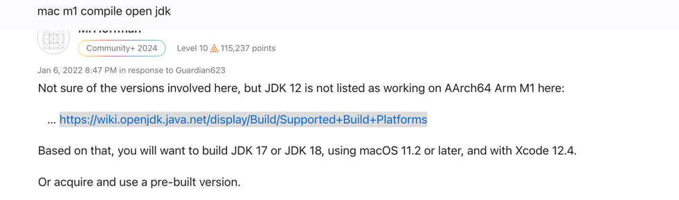
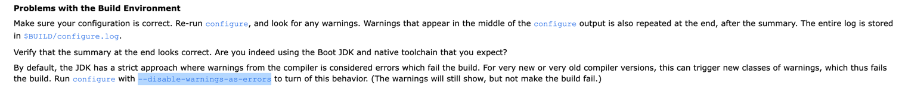
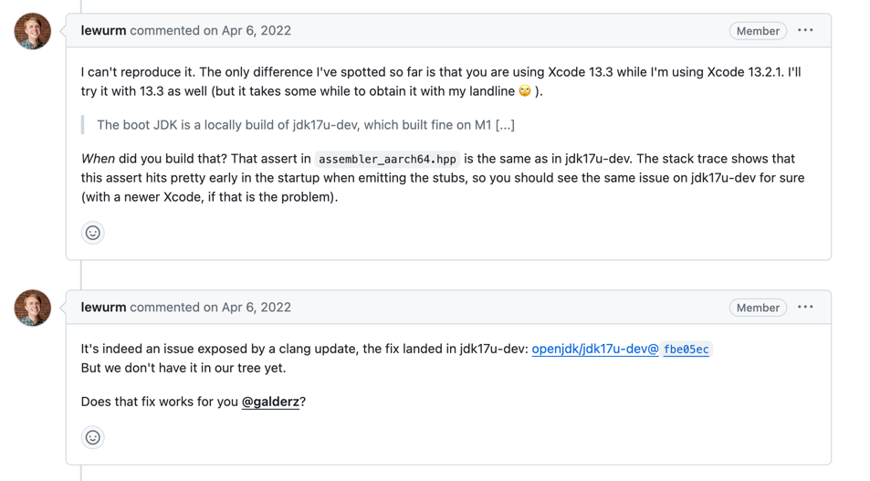
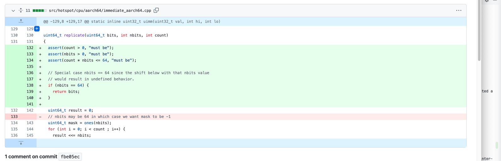

# 构建JDK18 遇到的一些问题

# 起因
刚开始是想构建JDK12的,但是由于JDK12的构建脚本还不支持mac aarch64 架构,
所以尝试构建JDK18,所受启发: https://discussions.apple.com/thread/253536115?sortBy=best

# 构建过程

### 1.warnings 作为致命错误

  根据构建文档中的疑难解答,我们只需要在configure的时候,添加参数 --disable-warnings-as-errors

  原文如下:

### 2.clang的最新问题(hotspot arm64 bug exposed by latest clang)
"Field too big for insn" error building on Apple M1 #2",起初这个问题受到启发: https://github.com/graalvm/labs-openjdk-17/issues/2
原文如下: 

参考文件: https://github.com/openjdk/jdk17u-dev/commit/fbe05ec561e8d2a061be126c969c37c219b594f3
原文通过修改了代码,在64位的时候,直接返回 ..
